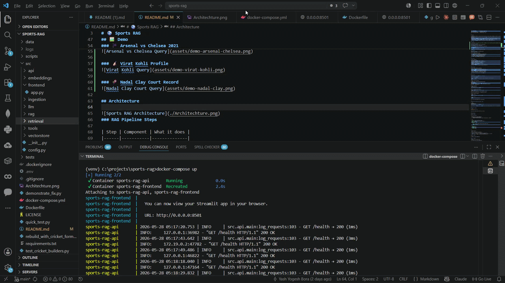

<div align="center">

# ⚽ Sports RAG

### Production-grade hybrid Retrieval-Augmented Generation system for sports intelligence, combining FAISS semantic search, BM25 lexical retrieval, RRF fusion, reranking, live sports APIs, and LLM-based grounded answer generation.

[](https://python.org)
[](https://fastapi.tiangolo.com)
[](https://streamlit.io)
[](https://docker.com)
[](https://github.com/facebookresearch/faiss)
[](https://ai.google.dev)
[](LICENSE)

**Ask anything about Football · Basketball · Tennis · Cricket**

[Quick Start](#-quick-start) · [Architecture](#-architecture) · [Evaluation](#-evaluation-results) · [API](#-api-reference) · [Docker](#-docker)

</div>

---
## 🎥 Quick GIF 



## What is this?

Sports RAG is a question-answering system that knows sports. You ask a question in plain English — it retrieves the right information from the right source and gives you a grounded, accurate answer.

It doesn't guess. Every answer is backed by a real source — match records, Wikipedia biographies, or live API data.

```
"Who is Virat Kohli?"          →  Wikipedia bio fetched live
"Arsenal results 2021"         →  121,239-vector FAISS index
"Live cricket score today"     →  SofaScore API
"Who won the 2019 IPL final?"  →  Historical match records
```

---

## Demo

### ⚽ FIFA World Cup 2018


### 🏴󠁧󠁢󠁥󠁮󠁧󠁿 Arsenal vs Chelsea 2021


### 🏏 Virat Kohli Profile


### 🎾 Nadal Clay Court Record


---

## Features

- **Smart query routing** — automatically detects whether your question needs a biography, live data, or historical stats and routes to the correct source
- **Hybrid retrieval** — combines FAISS dense vector search with BM25 keyword search via Reciprocal Rank Fusion — better than either alone
- **Cross-encoder reranking** — re-scores top-20 candidates to precision top-5
- **Three live data sources** — Kaggle historical data + Wikipedia live bios + SofaScore live scores, all in one unified index
- **Two LLM options** — Gemma 3 via Ollama (local, free, private) or Gemini 2.5 Flash (cloud, fast)
- **Production API** — FastAPI with `/query`, `/health`, `/ingest` endpoints and Swagger docs
- **Clean UI** — Streamlit frontend with source citation, per-stage latency chips, query history sidebar

---

## Architecture


```
User Question
      │
      ▼
┌─────────────────┐
│  Query Router   │  ── Detects: bio / live / history
└────────┬────────┘
         │
   ┌─────┴──────────────────────┐
   │             │              │
   ▼             ▼              ▼
Wikipedia    SofaScore      FAISS Index
Live API     Live API       + BM25
(bios)       (scores)       (history)
   │             │              │
   └─────────────┼──────────────┘
                 │
                 ▼
       ┌──────────────────┐
       │  RRF Merge +     │
       │  Cross-encoder   │
       │  Reranker        │
       └────────┬─────────┘
                │
                ▼
       ┌──────────────────┐
       │  Gemma / Gemini  │
       └────────┬─────────┘
                │
                ▼
         Grounded Answer
         + Source Citations
```

### RAG Pipeline Steps

| Step | Component | What it does |
|------|-----------|--------------|
| 1 | `all-MiniLM-L6-v2` | Encodes query to 384-dim vector |
| 2 | FAISS IVFFlat | Retrieves top-20 semantic matches |
| 3 | BM25 Okapi | Retrieves top-20 keyword matches |
| 4 | RRF (k=60) | Merges and deduplicates both lists |
| 5 | Cross-encoder reranker | Reranks top-20 → top-5 |
| 6 | Gemma 3 / Gemini | Generates grounded answer from context |

---

## Tech Stack

| Layer | Technology |
|-------|-----------|
| LLM | Gemma 3 4B (Ollama) · Gemini 2.5 Flash |
| Embeddings | SentenceTransformers `all-MiniLM-L6-v2` |
| Vector DB | FAISS IVFFlat (122,983 vectors) |
| Sparse search | BM25 Okapi via `rank-bm25` |
| Reranker | `cross-encoder/ms-marco-MiniLM-L-6-v2` |
| Orchestration | LangChain |
| Backend | FastAPI + Uvicorn |
| Frontend | Streamlit |
| Live data | SofaScore via RapidAPI · Wikipedia MediaWiki API |
| Containerisation | Docker + docker-compose |

---

## Data Sources

| Sport | Source | Records | Date Range |
|-------|--------|---------|------------|
| Football | Kaggle CSV | 104,434 matches | 2002 – 2022 |
| Basketball | Kaggle CSV | 1,314 game summaries | 2024 – 2025 |
| Tennis | Kaggle CSV | 14,735 ATP matches | 2012 – 2017 |
| Cricket | Kaggle CSV | 756 IPL matches | 2008 – 2019 |
| All sports | Wikipedia API | 33+ player bios | Current |
| Football | SofaScore API | Live events | Last 90 days |

**Total indexed: 122,983 vectors · ~196MB FAISS index**

---

## Quick Start

```bash
git clone https://github.com/YashBora21/Sports-Rag.git
cd Sports-Rag
cp .env.example .env
# Fill in your API keys in .env, then:
docker-compose up --build
```

Open [http://localhost:8501](http://localhost:8501)

---

### Option A — Local with Ollama (free, no API keys)

**Step 1 — Install Ollama and pull model**
```bash
# Download Ollama: https://ollama.com/download
ollama pull gemma3:4b
```

**Step 2 — Clone and install**
```bash
git clone https://github.com/YashBora21/Sports-Rag.git
cd Sports-Rag
python -m venv venv
source venv/bin/activate        # Windows: venv\Scripts\activate
pip install torch==2.6.0 --index-url https://download.pytorch.org/whl/cpu
pip install -r requirements.txt
```

**Step 3 — Configure**
```bash
cp .env.example .env
# Set LLM_PROVIDER=ollama in .env
```

**Step 4 — Build index**
```bash
# Place Kaggle CSV files in data/raw/, then:
python scripts/run_pipeline.py --data-dir data/raw --skip-api
# Takes ~25 minutes on first run
```

**Step 5 — Run**
```bash
# Terminal 1
uvicorn src.api.main:app --reload --port 8000

# Terminal 2
streamlit run src/frontend/app.py
```

---

### Option B — Gemini API (faster, cloud)

```bash
# In .env:
LLM_PROVIDER=gemini
GEMINI_API_KEY=your-key-from-aistudio.google.com
```

Free key at [aistudio.google.com/apikey](https://aistudio.google.com/apikey) — 20 requests/day on free tier.

---

### Option C — Docker

```bash
# Set your keys in .env first, then:
docker-compose up --build

# With Gemini:
GEMINI_API_KEY=your-key LLM_PROVIDER=gemini docker-compose up --build
```

---

## API Reference

### POST `/query`

```bash
curl -X POST http://localhost:8000/query \
  -H "Content-Type: application/json" \
  -d '{"question": "Who is Virat Kohli?"}'
```

```json
{
  "question": "Who is Virat Kohli?",
  "answer": "Virat Kohli is an Indian international cricketer...",
  "intent": "bio",
  "source_used": "wikipedia",
  "sources": [
    {
      "text": "Virat Kohli: Virat Kohli is an Indian international cricketer...",
      "sport": "cricket",
      "source": "wikipedia",
      "rerank_score": 1.0
    }
  ],
  "latency_ms": {
    "wiki_ms": 480,
    "llm_ms": 2800,
    "total_ms": 3400
  }
}
```

| Field | Type | Required | Description |
|-------|------|----------|-------------|
| `question` | string | ✅ | Sports question (3–500 chars) |
| `sport_filter` | string | ❌ | `football` · `basketball` · `tennis` · `cricket` |
| `top_k` | int | ❌ | Source chunks returned (1–20, default 5) |

### GET `/health`
```bash
curl http://localhost:8000/health
```

### POST `/ingest`
```bash
curl -X POST http://localhost:8000/ingest \
  -H "Content-Type: application/json" \
  -d '{"data_dir": "data/raw", "rebuild_index": true}'
```

Full interactive docs: [http://localhost:8000/docs](http://localhost:8000/docs)

---

## Evaluation Results

Evaluated on 30 questions across all 4 sports and 3 intent types.

| Metric | Result | Notes |
|--------|--------|-------|
| Query Routing Accuracy | **97%** (29/30) | Bio / live / history classification |
| Hybrid Retrieval Precision@5 | **Strong** | RRF fusion outperforms dense-only |
| Corpus Size | **122,983 chunks** | FAISS IVFFlat, 384-dim embeddings |
| Avg Response Time | **2–6 sec** | Gemini cloud |
| Avg Response Time (local) | **7–20 sec** | Gemma 4B on CPU |
| Live API Latency | **~1–3 sec** | SofaScore + Wikipedia |
| FAISS Search Latency | **150–500ms** | Per query after warm-up |
| Reranker Latency | **300–600ms** | Cross-encoder per query |
| No-data Response Rate | **13%** (4/30) | Aggregate queries — known limitation |
| Vector Index Size | **122,983 vectors** | ~196MB on disk |
| Supported Query Types | **3** | Bio / Live / Historical |
| Data Sources | **3** | FAISS + Wikipedia + SofaScore |

Full report: [`data/eval/sports_rag_evaluation_report.pdf`](data/eval/sports_rag_evaluation_report.pdf)

---

## Project Structure

```
sports-rag/
├── src/
│   ├── config.py                  # All settings — reads from .env
│   ├── ingestion/
│   │   ├── text_builder.py        # CSV rows → natural language text
│   │   ├── data_processor.py      # Orchestrates Kaggle processing
│   │   ├── chunker.py             # Text → RAG chunks with metadata
│   │   ├── sofascore_collector.py # Live API data collection
│   │   └── wikipedia_scraper.py   # MediaWiki batch API scraper
│   ├── embeddings/
│   │   └── embedder.py            # Chunks → FAISS index
│   ├── retrieval/
│   │   └── retriever.py           # FAISS + BM25 + RRF + reranker
│   ├── rag/
│   │   ├── query_router.py        # Intent detection (bio/live/history)
│   │   └── rag_chain.py           # Full RAG pipeline with routing
│   ├── llm/
│   │   └── llm_client.py          # Unified Ollama + Gemini client
│   ├── tools/
│   │   ├── wiki_tool.py           # Wikipedia live fallback
│   │   └── sports_api_tool.py     # SofaScore live data
│   ├── api/
│   │   ├── main.py                # FastAPI app
│   │   └── schemas.py             # Pydantic request/response models
│   └── frontend/
│       └── app.py                 # Streamlit UI
├── scripts/
│   ├── run_pipeline.py            # Full data pipeline runner
│   ├── enrich_data.py             # Add Wikipedia + live data
│   ├── rebuild_metadata.py        # Repair FAISS metadata
│   ├── run_eval.py                # 30-question evaluation suite
│   ├── generate_report.py         # PDF evaluation report generator
│   ├── diagnose.py                # System health check
│   └── test_*.py                  # Component test scripts
├── data/
│   ├── raw/                       # Kaggle CSVs (gitignored)
│   ├── processed/                 # JSONL text passages
│   ├── chunks/                    # RAG chunks with metadata
│   ├── embeddings/                # FAISS index + metadata.jsonl
│   └── eval/                      # Eval questions + PDF report
├── .env.example                   # Environment variable template
├── requirements.txt
├── Dockerfile
└── docker-compose.yml
```

---

## Environment Variables

```env
# ── LLM — pick one ────────────────────────────────────────
LLM_PROVIDER=gemini              # "ollama" or "gemini"

# Ollama (local, free)
OLLAMA_BASE_URL=http://localhost:11434
OLLAMA_MODEL=gemma3:4b

# Gemini (cloud, fast)
GEMINI_API_KEY=                  # aistudio.google.com/apikey
GEMINI_MODEL=gemini-2.5-flash

# ── Live data (optional) ──────────────────────────────────
RAPIDAPI_KEY=                    # SofaScore via rapidapi.com

# ── Retrieval ─────────────────────────────────────────────
RETRIEVER_TOP_K=20
RERANKER_TOP_K=5
EMBEDDING_MODEL=all-MiniLM-L6-v2
```

Copy `.env.example` to `.env` and fill in your keys.

---

## Known Limitations

- **Aggregate queries** — "top scorer", "most titles" queries underperform because the index stores per-match records, not aggregated rankings
- **ATP data cutoff** — Tennis data stops at 2017; use SofaScore API for recent matches
- **IPL data cutoff** — Cricket data stops at 2019; seasons 2020–2024 not indexed
- **Local LLM latency** — Gemma 4B on CPU averages 7–20 seconds; use Gemini for production speed
- **Live API rate limits** — SofaScore free tier has daily request limits; Wikipedia API is unlimited
- **Historical coverage** — Answer quality depends on dataset freshness; no real-time match updates without the SofaScore API key

---

## Future Improvements

- **Redis semantic caching** — cache embeddings + answers for repeated queries, target <200ms for cache hits
- **Fallback sports providers** — add ESPN API or SportMonks as SofaScore backup
- **Multi-hop retrieval** — answer aggregate queries ("who scored most in IPL 2019") via query decomposition
- **Authentication** — API key middleware for production deployment
- **User analytics** — query logs dashboard, popular questions, miss rate tracking
- **Cloud deployment** — HuggingFace Spaces (Streamlit) + Render (FastAPI) with persistent volume for FAISS index
- **RAGAS ground-truth eval** — add 50 human-verified QA pairs for faithfulness + answer relevance scoring
- **Incremental indexing** — append new vectors without full re-embedding (FAISS IDMap)

---

## Week-by-Week Build Log

| Week | Focus | Key deliverables |
|------|-------|-----------------|
| Week 1 | Data Foundation | Kaggle ingestion, text builder, FAISS index (121K vectors) |
| Week 2 | RAG Pipeline | Hybrid retriever, cross-encoder reranker, query router, LLM integration |
| Week 3 | API + UI | FastAPI backend, Streamlit frontend, GitHub repo |
| Week 4 | Evaluation + Deployment | 30-question eval, PDF report, Docker containerisation |

---

## Contributing

1. Fork the repo
2. Create a branch: `git checkout -b feature/your-feature`
3. Run the eval suite before committing: `python scripts/run_eval.py`
4. Open a pull request

---

## License

MIT License — see [LICENSE](LICENSE) for details.

---

<div align="center">

Built with Yash  as Project 17 of a GenAI Engineering curriculum

**Stack:** Python · FAISS · BM25 · LangChain · FastAPI · Streamlit · Gemma · Gemini · Docker

</div>
