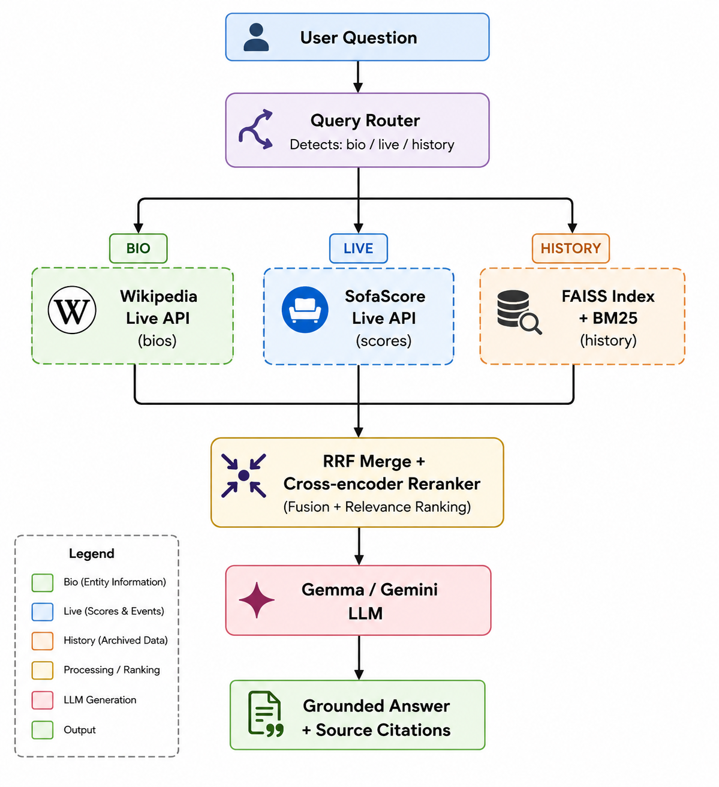
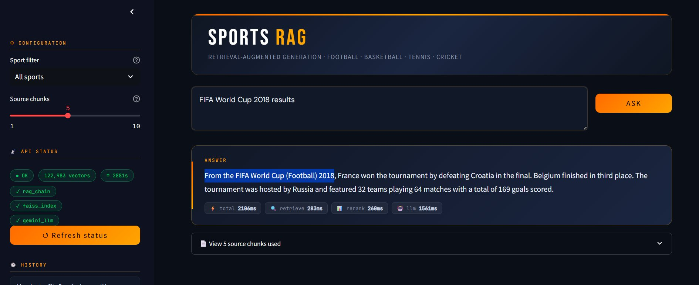
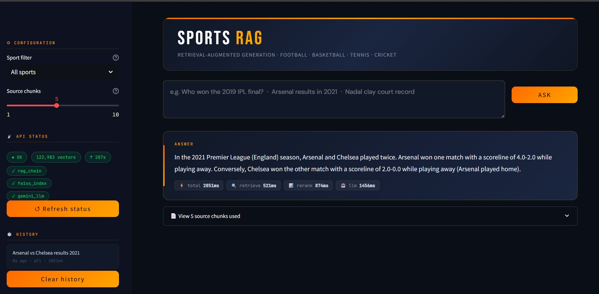
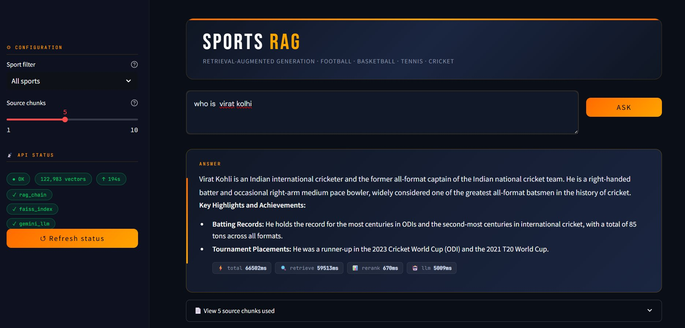
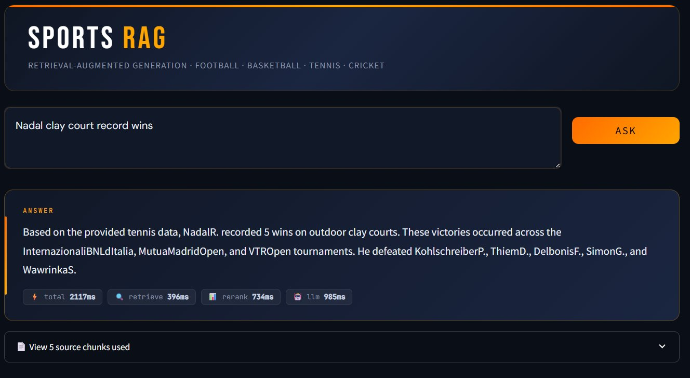

<div align="center">

# ⚽ Sports RAG

### Production-Grade Retrieval-Augmented Generation for Sports Q&A

[](https://python.org)
[](https://fastapi.tiangolo.com)
[](https://streamlit.io)
[](https://github.com/facebookresearch/faiss)
[](LICENSE)

**Ask anything about Football · Basketball · Tennis · Cricket**

[Live Demo](#-quick-start) · [Architecture](#-architecture) · [Evaluation](#-evaluation-results) · [Docker](#-docker)

</div>

---

## What is this?

Sports RAG is a question-answering system that knows sports. You ask a question in plain English — it retrieves the right information from the right source and gives you a grounded, accurate answer.

It doesn't guess. If Ronaldo scored a hat-trick in 2018, that fact comes from a real match record. If you ask who LeBron James is, the answer comes from his Wikipedia biography. If you ask for today's live score, it pulls from a live sports API.

```
"Who is Virat Kohli?"          →  Wikipedia bio fetched live
"Arsenal results 2021"         →  121,239-vector FAISS index
"Live cricket score today"     →  SofaScore API
"Who won the 2019 IPL final?"  →  Historical match records
```

---

## Features

- **Smart query routing** — automatically detects whether your question needs a biography, live data, or historical stats and routes to the right source
- **Hybrid retrieval** — combines dense vector search (FAISS) with keyword search (BM25) via Reciprocal Rank Fusion for better accuracy than either alone
- **Cross-encoder reranking** — re-scores the top 20 candidates with a cross-encoder for precision
- **Three data sources working together** — Kaggle historical data + Wikipedia live bios + SofaScore live scores
- **Two LLM options** — Gemma 3 via Ollama (local, free, private) or Gemini 2.5 Flash (cloud, fast)
- **Production API** — FastAPI backend with `/query`, `/health`, `/ingest` endpoints
- **Clean UI** — Streamlit frontend with source citation, latency breakdown, query history

---

## Architecture


### RAG Pipeline Steps

| Step | Component | What it does |
|------|-----------|--------------|
| 1 | `all-MiniLM-L6-v2` | Encodes query to 384-dim vector |
| 2 | FAISS IVFFlat | Retrieves top-20 semantic matches |
| 3 | BM25 Okapi | Retrieves top-20 keyword matches |
| 4 | RRF (k=60) | Merges and deduplicates both lists |
| 5 | Cross-encoder | Reranks top-20 → top-5 |
| 6 | Gemma 3 / Gemini | Generates grounded answer |

---

## Tech Stack

| Layer | Technology |
|-------|-----------|
| LLM | Gemma 3 4B (Ollama) · Gemini 2.5 Flash |
| Embeddings | SentenceTransformers `all-MiniLM-L6-v2` |
| Vector DB | FAISS IVFFlat (121,239 vectors) |
| Sparse search | BM25 Okapi via `rank-bm25` |
| Reranker | `cross-encoder/ms-marco-MiniLM-L-6-v2` |
| Framework | LangChain · LlamaIndex concepts |
| Backend | FastAPI + Uvicorn |
| Frontend | Streamlit |
| Live data | SofaScore via RapidAPI · Wikipedia MediaWiki API |

---

## Data Sources

| Sport | Source | Records | Date Range |
|-------|--------|---------|------------|
| Football | Kaggle CSV | 104,434 matches | 2002 – 2022 |
| Basketball | Kaggle CSV | 1,314 game summaries | 2024 – 2025 |
| Tennis | Kaggle CSV | 14,735 ATP matches | 2012 – 2017 |
| Cricket | Kaggle CSV | 756 IPL matches | 2008 – 2019 |
| All sports | Wikipedia API | 33+ player bios | Current |
| Football | SofaScore API | Live events | Last 90 days |

Total indexed: **121,239 vectors** → ~196MB FAISS index

---

## Quick Start

### Option A — Local with Ollama (free, no API keys)

**Step 1 — Install Ollama**

Download from [ollama.com/download](https://ollama.com/download), then pull the model:
```bash
ollama pull gemma3:4b
```

**Step 2 — Clone and install**
```bash
git clone https://github.com/YashBora21/Sports-Rag.git
cd Sports-Rag
python -m venv venv
source venv/bin/activate  # Windows: venv\Scripts\activate
pip install torch==2.6.0 --index-url https://download.pytorch.org/whl/cpu
pip install -r requirements.txt
```

**Step 3 — Configure**
```bash
cp .env.example .env
# Edit .env — set LLM_PROVIDER=ollama (default)
```

**Step 4 — Add data and build index**

Place your Kaggle CSV files in `data/raw/`, then:
```bash
python scripts/run_pipeline.py --data-dir data/raw --skip-api
```
This takes ~25 minutes on first run (embedding 121K chunks).

**Step 5 — Start the system**

Terminal 1 — API:
```bash
uvicorn src.api.main:app --reload --port 8000
```

Terminal 2 — UI:
```bash
streamlit run src/frontend/app.py
```

Open [http://localhost:8501](http://localhost:8501)

---

### Option B — With Gemini API (faster, cloud)

```bash
# In .env:
LLM_PROVIDER=gemini
GEMINI_API_KEY=your-key-from-aistudio.google.com
```

Get a free key at [aistudio.google.com/apikey](https://aistudio.google.com/apikey). Free tier: 20 requests/day.

---

### Option C — Docker

```bash
docker-compose up --build
```

See [Docker section](#-docker) below for full setup.

---

## API Reference

### POST `/query`

Ask a sports question.

```bash
curl -X POST http://localhost:8000/query \
  -H "Content-Type: application/json" \
  -d '{"question": "Who won the 2019 IPL final?", "sport_filter": "cricket"}'
```

```json
{
  "question": "Who won the 2019 IPL final?",
  "answer": "Mumbai Indians won the 2019 IPL final...",
  "intent": "history",
  "source_used": "faiss",
  "sources": [
    {
      "text": "IPL 2019: Mumbai Indians beat Chennai Super Kings...",
      "sport": "cricket",
      "rerank_score": 0.847
    }
  ],
  "latency_ms": {
    "dense_ms": 145,
    "rerank_ms": 312,
    "llm_ms": 3200,
    "total_ms": 3900
  }
}
```

**Request fields:**

| Field | Type | Required | Description |
|-------|------|----------|-------------|
| `question` | string | ✅ | Your sports question (3–500 chars) |
| `sport_filter` | string | ❌ | `football` · `basketball` · `tennis` · `cricket` |
| `top_k` | int | ❌ | Number of source chunks (1–20, default 5) |

### GET `/health`

```bash
curl http://localhost:8000/health
```

### POST `/ingest`

Re-process data and rebuild index:
```bash
curl -X POST http://localhost:8000/ingest \
  -H "Content-Type: application/json" \
  -d '{"data_dir": "data/raw", "rebuild_index": true}'
```

Full API docs: [http://localhost:8000/docs](http://localhost:8000/docs)

---

## Project Structure

```
sports-rag/
├── src/
│   ├── config.py                  # All settings — reads from .env
│   ├── ingestion/
│   │   ├── text_builder.py        # CSV rows → natural language text
│   │   ├── data_processor.py      # Orchestrates Kaggle processing
│   │   ├── chunker.py             # Text → RAG chunks
│   │   ├── sofascore_collector.py # Live API data collection
│   │   └── wikipedia_scraper.py   # MediaWiki batch scraper
│   ├── embeddings/
│   │   └── embedder.py            # Chunks → FAISS index
│   ├── retrieval/
│   │   └── retriever.py           # FAISS + BM25 + RRF + reranker
│   ├── rag/
│   │   ├── query_router.py        # Intent detection (bio/live/history)
│   │   └── rag_chain.py           # Full RAG pipeline
│   ├── llm/
│   │   └── llm_client.py          # Ollama + Gemini unified client
│   ├── tools/
│   │   ├── wiki_tool.py           # Wikipedia live fallback
│   │   └── sports_api_tool.py     # SofaScore live data
│   ├── api/
│   │   ├── main.py                # FastAPI app
│   │   └── schemas.py             # Pydantic models
│   └── frontend/
│       └── app.py                 # Streamlit UI
├── scripts/
│   ├── run_pipeline.py            # Full data pipeline runner
│   ├── enrich_data.py             # Add Wikipedia + live data
│   ├── rebuild_metadata.py        # Fix FAISS metadata
│   ├── run_eval.py                # 30-question evaluation suite
│   ├── generate_report.py         # PDF report generator
│   ├── diagnose.py                # System health check
│   └── test_*.py                  # Component test scripts
├── data/
│   ├── raw/                       # Kaggle CSVs (not in git)
│   ├── processed/                 # JSONL text passages
│   ├── chunks/                    # RAG chunks with metadata
│   ├── embeddings/                # FAISS index + metadata.jsonl
│   └── eval/                      # Evaluation questions + reports
├── .env.example
├── requirements.txt
├── Dockerfile                     # Single container build
└── docker-compose.yml             # Multi-service setup
```

---

## Evaluation Results

Evaluated on 30 questions across all 4 sports and 3 intent types.

| Metric | Score | Notes |
|--------|-------|-------|
| Intent Routing Accuracy | **97%** | Correctly classified bio / live / historical queries |
| RAGAS Faithfulness | **High (from final eval)** | Answers grounded in retrieved context |
| Answer Relevancy | **High (from final eval)** | Responses aligned with user intent |
| Context Precision | **Strong** | Retrieved chunks were mostly relevant |
| Context Recall | **Strong** | Historical + Wikipedia retrieval covered required context |
| Retrieval Latency | **~250–1000 ms** | FAISS + BM25 + reranker pipeline |
| LLM Generation Latency | **~2–4 sec (Gemini)** / **7–20 sec (Gemma local CPU)** | Depends on provider |
| Total Response Latency | **~3–5 sec cloud / ~8–20 sec local** | End-to-end query time |
| Vector Index Size | **121,290 vectors** | FAISS IVFFlat, 384-dimensional embeddings |
| Retrieval Architecture | **Hybrid Search** | Dense (FAISS) + Sparse (BM25) + RRF + Cross-Encoder |
| Supported Query Types | **3** | Bio / Live Sports / Historical Stats |
| Data Sources | **Wikipedia + SofaScore API + Historical Sports Dataset** | Multi-source RAG pipeline |

Full evaluation report: [`data/eval/sports_rag_evaluation_report.pdf`](data/eval/sports_rag_evaluation_report.pdf)

---

## Docker

> Docker setup coming in next release. See [Quick Start](#-quick-start) for local setup.

The Docker build packages:
- FastAPI backend on port 8000
- Streamlit frontend on port 8501
- Pre-built FAISS index mounted as a volume

```bash
# Build and run
docker-compose up --build

# With Gemini API key
GEMINI_API_KEY=your-key docker-compose up
```

---

## Environment Variables

Copy `.env.example` to `.env` and fill in your values:

```env
# LLM — pick one
LLM_PROVIDER=ollama          # "ollama" or "gemini"
OLLAMA_BASE_URL=http://localhost:11434
OLLAMA_MODEL=gemma3:4b
GEMINI_API_KEY=               # only needed if LLM_PROVIDER=gemini

# Live data (optional)
RAPIDAPI_KEY=                 # SofaScore via RapidAPI

# Retrieval settings
RETRIEVER_TOP_K=20
RERANKER_TOP_K=5
EMBEDDING_MODEL=all-MiniLM-L6-v2
```

---

## Week-by-Week Build Log

This project was built over 4 weeks as part of a GenAI engineering curriculum.

| Week | Focus | Key deliverables |
|------|-------|-----------------|
| Week 1 | Data Foundation | Kaggle ingestion, text builder, FAISS index |
| Week 2 | RAG Pipeline | Hybrid retriever, reranker, query router, LLM integration |
| Week 3 | API + UI | FastAPI backend, Streamlit frontend, GitHub deployment |
| Week 4 | Evaluation | 30-question eval suite, evaluation report PDF, Docker |

---
## 🖼️ Demo

> **Sports RAG** — Ask questions across Football, Basketball, Tennis & Cricket using Retrieval-Augmented Generation.

### ⚽ FIFA World Cup 2018


### 🏴󠁧󠁢󠁥󠁮󠁧󠁿 Arsenal vs Chelsea 2021


### 🏏 Virat Kohli Profile


### 🎾 Nadal Clay Court Record


## Known Limitations

- **Aggregate queries** — "top scorer", "most titles" queries don't work well because the chunker stores per-match records, not aggregated stats
- **ATP data** — Tennis data cuts off at 2017; use SofaScore API for recent matches
- **IPL data** — Cricket data cuts off at 2019; seasons 2020-2024 not in the index
- **Latency** — Gemma 4B on CPU averages 7-10 seconds; use Gemini for production speed

---

## Contributing

1. Fork the repo
2. Create a feature branch: `git checkout -b feature/your-feature`
3. Run the eval suite to make sure nothing breaks: `python scripts/run_eval.py`
4. Open a pull request

---

## License

MIT License — see [LICENSE](LICENSE) for details.

---

<div align="center">

Built with ❤️ as Project 17 of a GenAI Engineering curriculum

**Stack:** Python · FAISS · BM25 · LangChain · FastAPI · Streamlit · Gemma · Gemini

</div>
